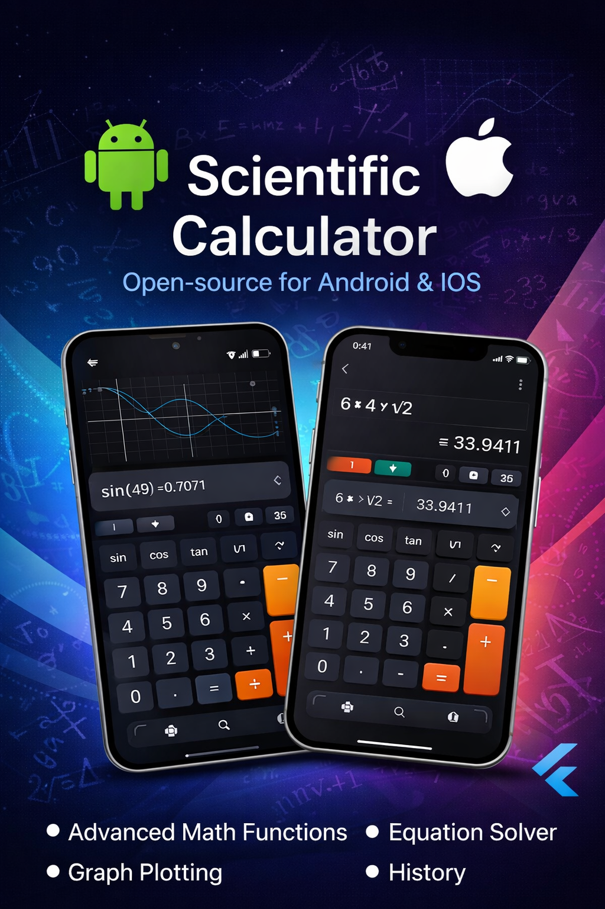

# Scientific Calculator

A modern scientific calculator built with Flutter.

## Features
- Basic calculations
- sin, cos, tan
- square root
- Clean user interface

## Technology
Built using Flutter.

